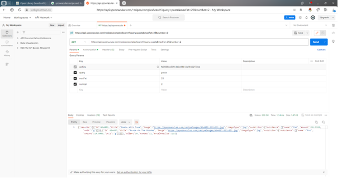
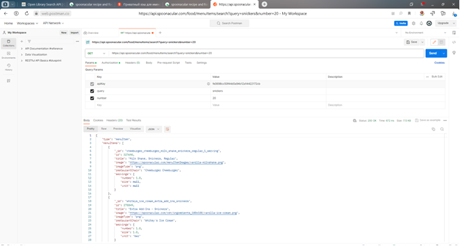
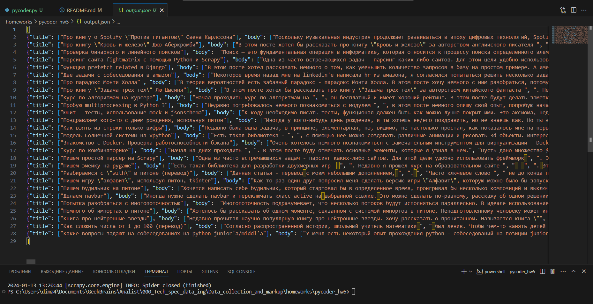

# Задание 1
1.	Ознакомиться с некоторые интересными API. https://docs.ozon.ru/api/seller/, https://developers.google.com/youtube/v3/getting-started, https://spoonacular.com/food-api
2.	Потренируйтесь делать запросы к API. Выберите публичный API, который вас интересует, и потренируйтесь делать API-запросы с помощью Postman.
3.	Поэкспериментируйте с различными типами запросов и попробуйте получить различные типы данных.

Запрос количества жиров в блюде Паста


Рецепт молочный коктейль сникерс обычный 1 порция

4.	Сценарий Foursquare
5.	Напишите сценарий на языке Python, который предложит пользователю ввести интересующую его категорию (например, кофейни, музеи, парки и т.д.).
6.	Используйте API Foursquare для поиска заведений в указанной категории.
7.	Получите название заведения, его адрес и рейтинг для каждого из них.
8.	Скрипт должен вывести название и адрес и рейтинг каждого заведения в консоль. [code](hw_1.py)

# Задание 2
1. Выполнить скрейпинг данных в веб-сайта http://books.toscrape.com/
и извлечь информацию о всех книгах на сайте во всех категориях: 
название, цену, количество товара в наличии (In stock (19 available)) в формате integer, описание [code](hw_2.py).
Затем сохранить эту информацию в JSON-файле [code](books_data.json).
### PS: Скрапинг количества книг по непонятной мне причине производится с главной страницы сайта, а не со страницы с описанием книги,
поэтому выполнение программы при указании индекса 2 выдает ошибку index out of range. 
Пришлось добавить лишние строки кода и проверки, что очень сильно увеличило время скрапинга

# Задание 3
1. Установите MongoDB на локальной машине, а также зарегистрируйтесь в онлайн-сервисе. https://www.mongodb.com/ https://www.mongodb.com/products/compass
2. Загрузите данные который вы получили на предыдущем уроке путем скрейпинга сайта с помощью Buautiful Soup в MongoDB и создайте базу данных и коллекции для их хранения [code](hw_3.py).
3. Поэкспериментируйте с различными методами запросов [code](001.png).


# Задание 4
Код [code](hw_4.py) и данные [file](countries_and_capitals.csv)
1. Выберите веб-сайт с табличными данными, который вас интересует.
2. Напишите код Python, использующий библиотеку requests для отправки HTTP GET-запроса на сайт и получения HTML-содержимого страницы.
3. Выполните парсинг содержимого HTML с помощью библиотеки lxml, чтобы извлечь данные из таблицы.
4. Сохраните извлеченные данные в CSV-файл с помощью модуля csv.

Ваш код должен включать следующее:

Строку агента пользователя в заголовке HTTP-запроса, чтобы имитировать веб-браузер и избежать блокировки сервером.
Выражения XPath для выбора элементов данных таблицы и извлечения их содержимого.
Обработка ошибок для случаев, когда данные не имеют ожидаемого формата.
Комментарии для объяснения цели и логики кода.

Примечание: Пожалуйста, не забывайте соблюдать этические и юридические нормы при веб-скреппинге.


# Задание 5
1. Найдите сайт, содержащий интересующий вас список или каталог. Это может быть список книг, фильмов, спортивных команд или что-то еще, что вас заинтересовало.

2. Создайте новый проект Scrapy и определите нового паука. С помощью атрибута start_urls укажите URL выбранной вами веб-страницы.

3. Определите метод парсинга для извлечения интересующих вас данных. Используйте селекторы XPath или CSS для навигации по HTML и извлечения данных. Возможно, потребуется извлечь данные с нескольких страниц или перейти по ссылкам на другие страницы.

4. Сохраните извлеченные данные в структурированном формате. Вы можете использовать оператор yield для возврата данных из паука, которые Scrapy может записать в файл в выбранном вами формате (например, JSON или CSV).

5. Конечным результатом работы должен быть код Scrapy Spider, а также пример выходных данных. 

Не забывайте соблюдать правила robots.txt и условия обслуживания веб-сайта, а также ответственно подходите к использованию веб-скрейпинга.

Выполнение задания #5:
1. Создадим проект командой ```scrapy startproject pycoder```
2. Перейдем в папку проекта командой ```scrapy genspider pycoder pycoder.ru```,
где pycoder - название паука, pycoder.ru - сайт для парсинга
3. Доработаем файл [pycoder.py](./pycoder_hw5//pycoder_hw5//spiders//pycoder.py) 
4. Доработаем файл [items.py](./pycoder_hw5//pycoder_hw5/items.py)
5. Запустим паука командой ```scrapy crawl pycoder```
6. Для сохранения данных используем команду ```scrapy crawl pycoder -o output.json```, где output - название файла, в котором сохранены данные.
Скрин полученных данных 
Также можно использовать команду ```scrapy crawl pycoder -o output.csv -t csv``` для сохранения данных в формате csv
1. Если возникли проблемы с кодировкой, то установите настройку FEED_EXPORT_ENCODING в [settings.py](./pycoder_hw5/pycoder_hw5/settings.py) ```FEED_EXPORT_ENCODING = 'utf-8'```


# Задание 6
Scrapy. Парсинг фото и файлов
1. Создайте новый проект Scrapy. Дайте ему подходящее имя и убедитесь, что ваше окружение правильно настроено для работы с проектом [проект](../homeworks/scraper_hw6/).
2. Создайте нового паука, способного перемещаться по сайту books.toscrape.com. Ваш паук должен уметь перемещаться по категориям фотографий и получать доступ к страницам отдельных фотографий [паук](../scraper_hw6/scraper_hw6/spiders/books_spider.py).
3. Определите элемент (Item) в Scrapy, который будет представлять изображение. Ваш элемент должен включать такие детали, как URL изображения, название изображения и категорию, к которой оно принадлежит [code](../scraper_hw6/scraper_hw6/items.py).
4. Используйте Scrapy ImagesPipeline для загрузки изображений. Обязательно установите параметр IMAGES_STORE в файле settings.py. Убедитесь, что ваш паук правильно выдает элементы изображений, которые может обработать ImagesPipeline [code](../scraper_hw6/scraper_hw6/pipelines.py).
5. Сохраните дополнительные сведения об изображениях (название, категория) в CSV-файле. Каждая строка должна соответствовать одному изображению и содержать URL изображения, локальный путь к файлу (после загрузки), название и категорию [файл](../homeworks/scraper_hw6/books_scrape.csv).


# Задание 7
1. Выберите веб-сайт, который содержит информацию, представляющую интерес для извлечения данных. Это может быть новостной сайт, платформа для электронной коммерции или любой другой сайт, который позволяет осуществлять скрейпинг (убедитесь в соблюдении условий обслуживания сайта).
2. Используя Selenium, напишите сценарий для автоматизации процесса перехода на нужную страницу сайта [code](../homeworks/hw_7_selenium.py).
3. Определите элементы HTML, содержащие информацию, которую вы хотите извлечь (например, заголовки статей, названия продуктов, цены и т.д.).
4. Используйте BeautifulSoup для парсинга содержимого HTML и извлечения нужной информации из идентифицированных элементов [code](../homeworks/hw_7_bs.py).
5. Обработайте любые ошибки или исключения, которые могут возникнуть в процессе скрейпинга.
6. Протестируйте свой скрипт на различных сценариях, чтобы убедиться, что он точно извлекает нужные данные.
7. Предоставьте ваш Python-скрипт вместе с кратким отчетом (не более 1 страницы), который включает следующее: URL сайта. Укажите URL сайта, который вы выбрали для анализа. Описание. Предоставьте краткое описание информации, которую вы хотели извлечь из сайта. Подход. Объясните подход, который вы использовали для навигации по сайту, определения соответствующих элементов и извлечения нужных данных. Трудности. Опишите все проблемы и препятствия, с которыми вы столкнулись в ходе реализации проекта, и как вы их преодолели. Результаты. Включите образец извлеченных данных в выбранном вами структурированном формате (например, CSV или JSON). Примечание: Обязательно соблюдайте условия обслуживания сайта и избегайте чрезмерного скрейпинга, который может нарушить нормальную работу сайта [отчет](../homeworks/report.md).

# Задание 8
- Описание задания и решения в файле [тык](../homeworks/hw_8/hw_8.ipynb)
- Входные и полученные датасеты в папке [тык](../homeworks/hw_8/)

# Задание 9
- Описание задания и решения в файле [тык](../homeworks/hw_9/hw_9.ipynb)
- Входные и полученные датасеты в папке [тык](../homeworks/hw_9/)
